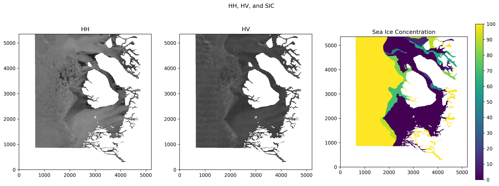
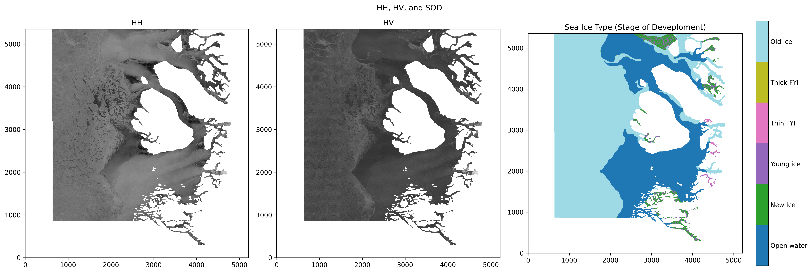

# Awesome  Sea Ice Papers

## Overview
This repository is a curated collection of academic papers focused on semi-supervised and supervised learning techniques for sea ice concentration and sea ice type classification. It emphasizes research on methodologies related to both concentration estimation and type classification, including approaches for patch-level image classification and pixel-level semantic segmentation, providing a comprehensive resource for researchers and practitioners in the field.

 

## Table of Contents

- [Introduction](#introduction)
- [Research Areas](#research-areas)
  - [Sea Ice Concentration](#sea-ice-concentration)
    - [Semi-Supervised Learning](#semi-supervised-learning-sea-ice-concentration)
    - [Supervised Learning](#supervised-learning-sea-ice-concentration)
  - [Sea Ice Type Classification](#sea-ice-type-classification)
    - [Semi-Supervised Learning](#semi-supervised-learning-sea-ice-type-classification)
    - [Supervised Learning](#supervised-learning-sea-ice-type-classification)
- [How to Contribute](#how-to-contribute)
- [Awesome Resources](#awesome-resources)
- [License](#license)

## Introduction
Sea ice classification is a crucial task for understanding and predicting Arctic and Antarctic ice conditions. This repository aggregates key papers that explore various machine learning techniques, including semi-supervised and supervised learning approaches, to classify sea ice type and concentration effectively. The focus is on methodologies that target both patch-level classification and pixel-level semantic segmentation.

## Sea Ice Concentration

### Semi-Supervised Learning (Sea Ice Concentration)

| Paper Title | Year |
|-------------|------|
| [Weakly Supervised Learning for Pixel-Level Sea Ice Concentration Extraction Using AI4Arctic Sea Ice Challenge Dataset](https://ieeexplore.ieee.org/abstract/document/10335753) | 2023 |

### Supervised Learning (Sea Ice Concentration)

| Paper Title | Year | Task Type |
|-------------|------|----------------------------|
| [Sea Ice Concentration Estimation During Melt From Dual-Pol SAR Scenes Using Deep Convolutional Neural Networks: A Case Study](https://ieeexplore.ieee.org/document/7448925) | 2016 |  Classification |
| [ICE CONCENTRATION ESTIMATION IN THE GULF OF ST. LAWRENCE USING FULLY CONVOLUTIONAL NEURAL NETWORK](https://ieeexplore-ieee-org.aurarialibrary.idm.oclc.org/stamp/stamp.jsp?tp=&arnumber=8128124) | 2017 | Classification |
| [Sea Ice Concentration Estimation during Freeze-Up from SAR Imagery Using a Convolutional Neural Network](https://www.mdpi.com/2072-4292/9/5/408)| 2017 | Classification |
| [Sea Ice Sensing From GNSS-R Data Using Convolutional Neural Networks](https://ieeexplore-ieee-org.aurarialibrary.idm.oclc.org/document/8418469) | 2018| Classification |
| [Baltic Sea Ice Concentration Estimation From C-Band Dual-Polarized SAR Imagery by Image Segmentation and Convolutional Neural Networks](https://ieeexplore-ieee-org.aurarialibrary.idm.oclc.org/document/9500042) | 2021 | Classification |
| [Impact of intermediate ice concentration training data on sea ice concentration estimates from a convolutional neural network](https://www-tandfonline-com.aurarialibrary.idm.oclc.org/doi/full/10.1080/01431161.2019.1582113) | 2018 | Classification |
| [Estimating Sea Ice Concentration From SAR: Training Convolutional Neural Networks With Passive Microwave Data](https://ieeexplore-ieee-org.aurarialibrary.idm.oclc.org/document/8636521) | 2019 | Classification |
| [Prediction of monthly Arctic sea ice concentrations using satellite and reanalysis data based on convolutional neural networks](https://tc.copernicus.org/articles/14/1083/2020/) | 2020 | Classification |
| [Accounting for Label Errors When Training a Convolutional Neural Network to Estimate Sea Ice Concentration Using Operational Ice Charts](https://ieeexplore.ieee.org/document/9674865) | 2022 | Classification |
| [A Mid- and Long-Term Arctic Sea Ice Concentration Prediction Model Based on Deep Learning Technology](https://www.mdpi.com/2072-4292/14/12/2889) | 2022 | Classification |
| [ Predicting Sea Ice Concentration With Uncertainty Quantification Using Passive Microwave and Reanalysis Data: A Case Study in Baffin Bay](https://ieeexplore-ieee-org.aurarialibrary.idm.oclc.org/document/10054403) | 2023 | Classification |
| [Prediction of Categorized Sea Ice Concentration From Sentinel-1 SAR Images Based on a Fully Convolutional Network](https://ieeexplore.ieee.org/document/9408349) | 2021 | Segmentation |
| [Sea Ice Concentration Estimation: Using Passive Microwave and SAR Data With a U-Net and Curriculum Learning](https://ieeexplore.ieee.org/document/9416884) | 2021 | Segmentation |
| [Seasonal Arctic sea ice forecasting with probabilistic deep learning](https://www.nature.com/articles/s41467-021-25257-4) | 2021 | Segmentation |
| [AI4SeaIce: Toward Solving Ambiguous SAR Textures in Convolutional Neural Networks for Automatic Sea Ice Concentration Charting](https://ieeexplore.ieee.org/document/9705586) | 2022 | Segmentation |
| [Super-Resolution-Aided Sea Ice Concentration Estimation From AMSR2 Images by Encoder–Decoder Networks With Atrous Convolution](https://ieeexplore.ieee.org/document/9999481) | 2022 | Segmentation |

## Sea Ice Type Classification

### Semi-Supervised Learning (Sea Ice Type Classification)

| Paper Title | Year |
|-------------|------|
| [A semi-supervised approach for ice-water classification using dual-polarization SAR satellite imagery](https://ieeexplore.ieee.org/document/7301380) | 2015|
| [A cooperative framework based on active and semi-supervised learning for sea ice classification using EO-1 Hyperion data](https://www.jstage.jst.go.jp/article/tjsass/62/6/62_T-19-6/_pdf) | 2019|
| [Deep learning for sea-ice classification on synthetic aperture radar (SAR) images in Earth observation](https://www.diva-portal.org/smash/get/diva2:1450605/FULLTEXT01.pdf#page=27.19) | 2019|
| [Deep semisupervised teacher–student model based on label propagation for sea ice classification](https://ieeexplore.ieee.org/document/9573360)| 2021|
| [Fine-Scale Sea Ice Segmentation for High-Resolution Satellite Imagery with Weakly-Supervised CNNs](https://www.mdpi.com/2072-4292/13/18/3562) | 2021 | 
| [EMI-SUPERVISED SEA ICE CLASSIFICATION OF SAR IMAGERY BASED ON GRAPH CONVOLUTIONAL NETWORK](https://ieeexplore-ieee-org.aurarialibrary.idm.oclc.org/stamp/stamp.jsp?tp=&arnumber=9883410) | 2022 | 
| [REGION-LEVEL LABELS IN ICE CHARTS CAN PRO-DUCE PIXEL-LEVEL SEGMENTATION FOR SEA ICE TYPES](https://arxiv.org/pdf/2405.10456) | 2024 |

### Supervised Learning (Sea Ice Type Classification)

| Paper Title | Year | Task Type|
|------------------------|------|-----|
| [SAR Sea-Ice Image Analysis Based on Iterative Region Growing Using Semantics](https://ieeexplore.ieee.org/abstract/document/4378543) | 2007 | Classification |
| [Gaofen-3 sea ice detection based on deep learning](https://ieeexplore.ieee.org/document/8293267) | 2017 | Classification |
| [Sea ice and open water classification of SAR imagery using CNN-based transfer learning](https://ieeexplore.ieee.org/document/8127693) | 2017| Classification |
| [A residual convolution neural network for sea ice classification with Sentinel-1 SAR imagery](https://ieeexplore.ieee.org/document/8637496) | 2018| Classification |
| [Convolutional Neural Networks-Based Sea Ice Detection From TDS-1 Data](https://ieeexplore-ieee-org.aurarialibrary.idm.oclc.org/document/8572899) | 2018 | Classification |
| [Hyperspectral sea ice image classification based on the spectral-spatial-joint feature with deep learning](https://www.mdpi.com/2072-4292/11/18/2170) | 2019 | Classification |
| [Classification of sea ice types in Sentinel-1 SAR data using convolutional neural networks](https://www.mdpi.com/2072-4292/12/13/2165) | 2020| Classification |
| [Combining 3D-CNN and squeeze-and-excitation networks for remote sensing sea ice image classification](https://onlinelibrary.wiley.com/doi/10.1155/2020/8065396) | 2020| Classification |
| [Proof of concept for sea ice stage of development classification using deep learning](https://www.mdpi.com/2072-4292/12/15/2486) | 2020| Classification |
| [Sea ice classification of SAR imagery based on convolution neural networks](https://www.mdpi.com/2072-4292/13/9/1734) | 2021 | Classification |
| [Deep learning based sea ice classification with Gaofen-3 fully polarimetric SAR data](https://www.mdpi.com/2072-4292/13/8/1452) | 2021| Classification |
| [Remote sensing sea ice classification based on DenseNet and heterogeneous data fusion](https://www.spiedigitallibrary.org/journals/journal-of-applied-remote-sensing/volume-16/issue-4/044517/Remote-sensing-sea-ice-classification-based-on-DenseNet-and-heterogeneous/10.1117/1.JRS.16.044517.short#_=_) | 2022| Classification |
| [Eastern Arctic Sea Ice Sensing: First Results from the RADARSAT Constellation Mission Data](https://www.mdpi.com/2072-4292/14/5/1165)| 2022| Classification |
| [Sea ice–water classification of RADARSAT-2 imagery based on residual neural networks (ResNet) with regional pooling](https://www.mdpi.com/2072-4292/14/13/3025) | 2022| Classification |
| [AM-ResNet: An Attention-Based Multi-Label Classification Network](https://ieeexplore-ieee-org.aurarialibrary.idm.oclc.org/stamp/stamp.jsp?tp=&arnumber=10011843) | 2022 | Classification |
| [Sea-Ice Mapping of RADARSAT-2 Imagery by Integrating Spatial Contexture With Textural Features](https://ieeexplore.ieee.org/document/9887856) | 2022| Classification |
| [Sea ice and water classification on dual-polarized Sentinel-1 imagery during melting season](https://tc.copernicus.org/preprints/tc-2021-85) | 2021| Classification |
| [ Classification of sea ice types in Sentinel-1 synthetic aperture radar images](https://tc.copernicus.org/articles/14/2629/2020) | 2020| Classification |
| [Sea ice and open water classification of SAR images using a deep learning model](https://ieeexplore.ieee.org/document/9323990)| 2020 | Classification |
| [A Convolutional Neural Network Architecture for Sentinel-1 and AMSR2 Data Fusion](https://ieeexplore.ieee.org/document/9133205) | 2020 | Classification |
| [Hyperspectral Sea Ice Image Classification Based on the Spectral-Spatial-Joint Feature with the PCA Network](https://www.mdpi.com/2072-4292/13/12/2253) | 2021 | Classification |
| [Automatic sea-ice classification of sar images based on spatial and temporal features learning](https://ieeexplore.ieee.org/document/9332239) | 2021 | Classification |
| [Robust Multiseasonal Ice Classification From High-Resolution X-Band SAR](https://ieeexplore.ieee.org/stamp/stamp.jsp?tp=&arnumber=9686749) | 2022 | Classification |
| [An Improved Sea Ice Classification Algorithm with Gaofen-3 Dual-Polarization SAR Data Based on Deep Convolutional Neural Networks](https://www.mdpi.com/2072-4292/14/4/906) | 2022 | Classification |
| [Sea ice classification with dual-polarized SAR imagery: a hierarchical pipeline](https://ieeexplore-ieee-org.aurarialibrary.idm.oclc.org/stamp/stamp.jsp?tp=&arnumber=10031236) | 2023 | Classification |
| [Sea Ice Detection from SAR Images Based on Deep Fully Convolutional Networks](https://link.springer.com/chapter/10.1007/978-981-19-6375-9_12) | 2023 | Classification |
| [ICENET: A Semantic Segmentation Deep Network for River Ice by Fusing Positional and Channel-Wise Attentive Features](https://www.mdpi.com/2072-4292/12/2/221) | 2020 | Segmentation | 
| [Sea Ice Classification via Deep Neural Network Semantic Segmentation](https://ieeexplore-ieee-org.aurarialibrary.idm.oclc.org/document/9225140) | 2020 | Segmentation |
| [Classifying sea ice types from SAR images using a U-Net-based deep learning model](https://ieeexplore.ieee.org/document/9554511) | 2021 | Segmentation |
| [Development of a dual-attention U-Net model for sea ice and open water classification on SAR images](https://ieeexplore.ieee.org/document/9361068) | 2021 | Segmentation|
| [ARCTIC SEA ICE MAPPING USING SENTINEL-1 SAR SCENES WITH A CONVOLUTIONAL NEURAL NETWORK](https://elib.dlr.de/141436/1/2021%20IGARSS%20Murashkin%20FROST%200005660.pdf) | 2021 | Segmentation |
| [In-situ sea ice detection using DeepLabv3 semantic segmentation](https://ieeexplore.ieee.org/document/9705801) | 2021| Segmentation|
| [Arctic sea ice cover data from spaceborne synthetic aperture radar by deep learning](https://essd.copernicus.org/articles/13/2723/2021/) | 2021| Segmentation|
| [Semantic image segmentation for sea ice parameters recognition using deep convolutional neural networks.](https://www.sciencedirect.com/science/article/pii/S1569843222000875) | 2022| Segmentation|
| [Semantic Segmentation of Sea Ice Based on U-net Network Modification](https://ieeexplore-ieee-org.aurarialibrary.idm.oclc.org/stamp/stamp.jsp?tp=&arnumber=10011899) | 2022 | Segmentation |
| [Improved Sea-Ice Identification Using Semantic Segmentation With Raindrop Removal](https://ieeexplore.ieee.org/document/9709781) | 2022 | Segmentation |
| [Semantic segmentation of Arctic Sea ice in summer from remote sensing satellite images based on BAU-NET](https://www.spiedigitallibrary.org/journals/journal-of-applied-remote-sensing/volume-16/issue-4/046514/Semantic-segmentation-of-Arctic-Sea-ice-in-summer-from-remote/10.1117/1.JRS.16.046514.short) | 2022| Segmentation|
| [E-MPSPNet: Ice–Water SAR Scene Segmentation Based on Multi-Scale Semantic Features and Edge Supervision](https://mdpi-res.com/remotesensing/remotesensing-14-05753/article_deploy/remotesensing-14-05753.pdf?version=1668433123) | 2022 |Segmentation |
| [Enhancing sea ice segmentation in Sentinel-1 images with atrous convolutions](https://www.tandfonline.com/doi/full/10.1080/01431161.2023.2248560) | 2023| Segmentation |
| [Sea-Ice Classification Using Conditional Generative Adversarial Networks](https://ieeexplore-ieee-org.aurarialibrary.idm.oclc.org/document/10076821) | 2023 | Segmentation |
| [Fine extraction of arctic sea ice based on CA-DeepLabV3+ model](https://www.spiedigitallibrary.org/conference-proceedings-of-spie/12797/127971P/Fine-extraction-of-arctic-sea-ice-based-on-CA-DeepLabV3/10.1117/12.3007422.short) | 2023| Segmentation |
| [A Hierarchical Multitask U-Net for Automated Sea Ice Mapping from AI4Arctic Sea Ice Challenge Dataset](https://ieeexplore.ieee.org/document/10337385) | 2023 | Segmentation |
| [Decoding the Partial Pretrained Networks for Sea-Ice Segmentation of 2021 Gaofen Challenge](https://ieeexplore.ieee.org/document/9793723) | 2022 | Segmentation |
| [Combining the U-Net model and a Multi-textRG algorithm for fine SAR ice-water classification](https://egusphere.copernicus.org/preprints/2024/egusphere-2024-1177/) | 2024 | Segmentation |

## How to Contribute

We welcome contributions to this repository! Please see our [Contribution Guide](CONTRIBUTING.md) for more details.

## License

This project is licensed under the MIT License - see the [LICENSE](LICENSE) file for details.
